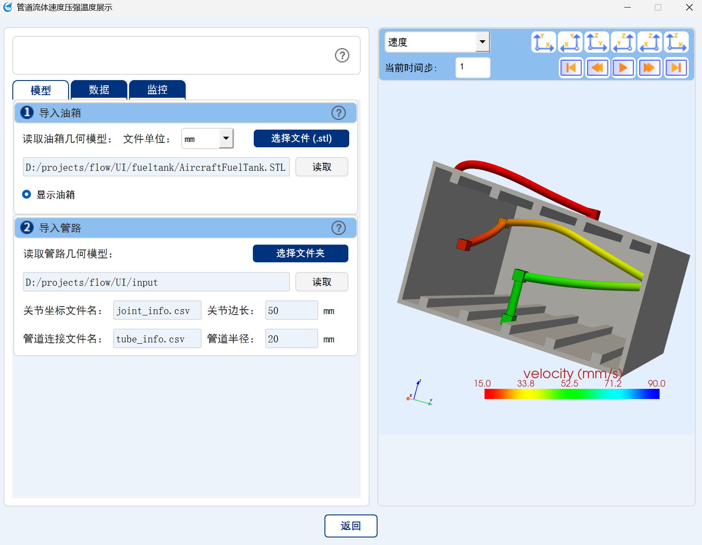

# Digital Twin System for Aircraft Fuel Tank

The code was developed by P.H. Zhang (2025).

## Abstract

The attribute values of the liquid in the aircraft's fuel tank is constantly change during flight. To ensure the safety of the flight, real-time monitoring of liquid is required. We designed a humanized digital twin system of aircraft fuel tank, which can display the velocity, pressure, and temperature of the liquid in the pipelines in real time, and send warning messages when the values exceed the preset range.

## Overview

- **Physical structure**: The model of fuel tank and pipelines can be freely defined by users.
- **Liquid attribute**: Velocity, pressure, and temperature.
- **Safety monitor**: Real-time monitor whether the values exceeds the safety ranges.
- **Temporal display**: Can automatically replay the attribute values varying over time.
- **User interface**: (*./User_Interface*) QtDesigner to design UI. PyQt5 to write code.

## File Structure

Files structure is as follows:

```
├── User_Interface                          # User interface
    ├── main.py                             # Run to start user interface of program
    ├── ui_flow.ui                          # Main interface Window designed by QtDesigner
    ├── ui_flow.py                          # Main interface Window code directly generated by pyuic5
    ├── ui_integrated.py                    # Define function on interface
    ├── res.qrc                             # Resourses including images designed by QtDesigner
    ├── res_rc.py                           # Resourses code directly generated by pyrcc
    └── ...
├── input                                   # Data for demo, which can be freely defined by user
    ├── AircraftFuelTank.STL                # Fuel tank model
    ├── joint_info.csv                      # Joint coordinates of pipelines
    ├── tube_info.csv                       # Tube connections of pipelines
    ├── input_1.csv                         # Attribute data at time step 1, whose name must be consistent with the folder name
    └── ...
└── readme.md                               # This file  
```

## User Manual

The detailed user manual is available in *./User_Interface/user_manual.pdf*.

## Program

### Structure of program files

The detailed program code is available in *./User_Interface*.

We use QtDesigner to design UI and automatically generate ui and qrc files. Then we use pyuic5 to tranlaste ui files into py files, and use pyrcc to tranlaste qrc files into py files. We combine the aforementioned files with other functional files to make final program.

### User interface

The UI is displayed as follows.

<p align="center"></p>

## License

This code is provided for educational and research purposes.

